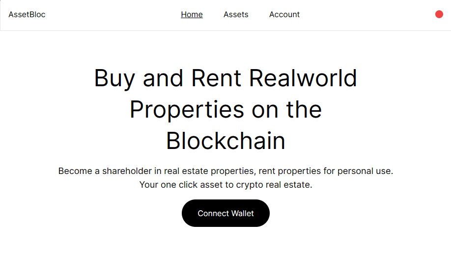

# AssetBloc

### Buy and Rent Assets

### Table of Content

- [Description](#description)
- [Technologies](#technologies)
- [Features](#features)
- [Usage](#usage)
- [Source](#source)
- [License](#license)

### **Description**

AssetBloc is a blockchain powered platform on the BNB Chain that enables users to buy shareof realworld assets and rent properties all using crypto currency.

### Illustrations

### **Technologies**

**Blockend**
- Javascript
- Hardhat
- Ethers.js
- Solidity

**Frontend**
- Typescipt
- Next.js
- Tailwind CSS
- Ethers.js V6

### **Features**

- Explore Assets on the blockchain from anywhere
- Buy shares is a real world real estate property using crypto
- Lock, Unlock and Sell shares
- Rent properties and renue rent
- Take profit from rents - FOR SHAREHOLDERS
- Manage shares dashboard.

### **Usage**

It’s pretty easy to use, just visit [AssetBloc's website](http://asset-bloc.vercel.app), connect wallet and deposit BNB (Test) to access all features available.

### **Source**

Contributors:

| Name | Role | Github |
| --- | --- | --- |
| Adams Dave | Blockend | https://github.com/adamsdavee  |
| Nwaoha Precious | Frontend Web3 | https://github.com/preciousnwaoha  |

### **License**

MIT